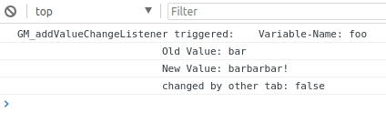
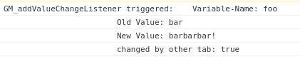

## How to use GM_addValueChangeListener in Tampermonkey

If you are writing userscripts for [Tampermonkey](http://tampermonkey.net/), [Greasemonkey](https://wiki.greasespot.net/Main_Page) etc., you might have run into the situation, where you wanted a certain function in one tab to be informed instantly, when a value in another tab changed.

Tampermonkey introduced a function that helps you with the problem, and while the docs of tampermonkey are *suboptimal*, I wrote this script to show, how it works.

### after you installed the script in Tampermonkey

1. open https://www.amnesty.org/en/ in a browser tab
1. open the webconsole in this tab
1. open another tab and webconsole and load https://www.eff.org in this tab

After you're done with the modals  in both tabs, compare the output of the console ...

#### Console-Output on eff-page:

#### Console-Output on amnesty-page:

### browser-compatibility

I've tested the script with

* chromium (ubuntu, 63.0.3239.84)
* chrome (ubuntu, 62.0.3202.75)
* firefox (ubuntu, quantum / 57.0.1)
* microsoft edge ()

